## 💪 `Fullstack Gym IoT App`

This project is a web-based Gym Management System that allows both administrators and users to interact with the system. The application integrates NFC cards for gym access, where users can check in and out of the gym. Admins can manage users, update pricing, extend memberships, and view the number of people inside the gym in real-time. Additionally, admins can enter users' measurements (e.g., height, weight), and users can manage their accounts.

### Admin Dashboard:

- Add new users and assign NFC cards.
- Extend user memberships.
- View the current number of people inside the gym.
- Update pricing for memberships.
- Enter user measurements (e.g., height, weight).
- Reset their own password.

### User Account:

- Users can check how many days are left on their membership.
- Users can view their measurements, but cannot modify them.
- Users can reset their own password.

<hr>

<div>
<div align="center">
<h3>⚡Home Page </h3>
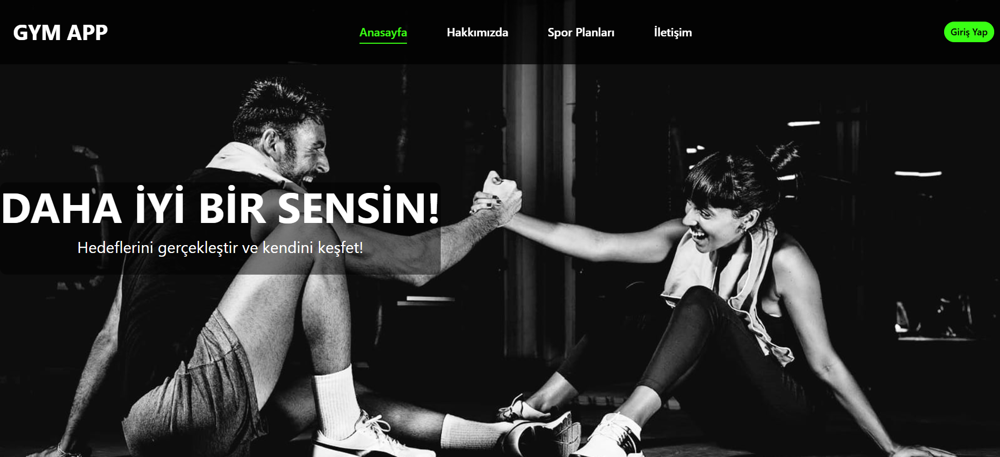
</div>

<br>

<details>
<summary>📕 About Page </summary>
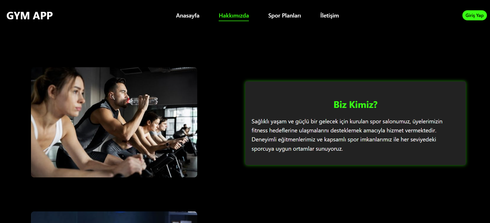
</details>

<details>
<summary>💵 Pricing Page </summary>
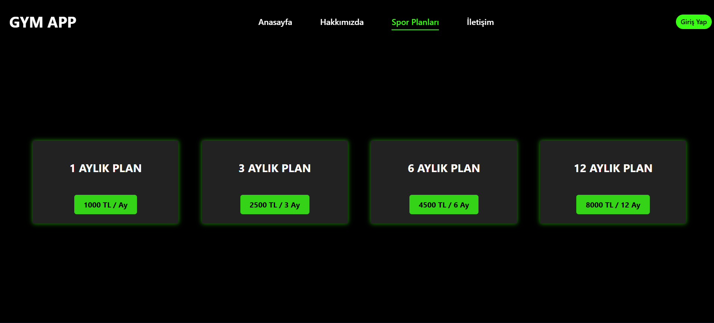
</details>

<details>
<summary>📞 Contact Page </summary>
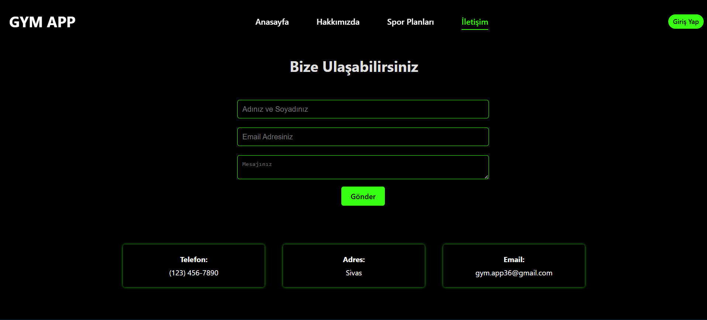
</details>

<details>
<summary>🔑 Login Page </summary>
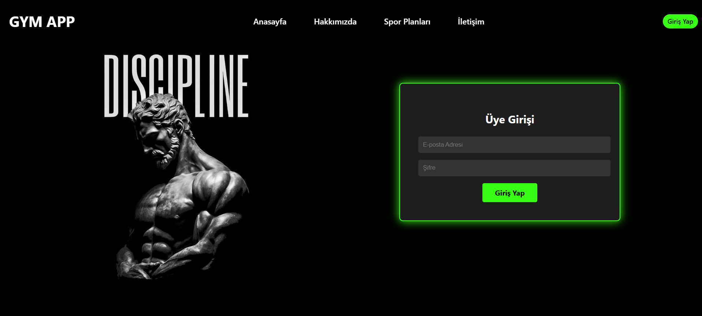
</details>

</div>
<hr>

<div>
<div align="center">
<h3>⚡Admin Page </h3>
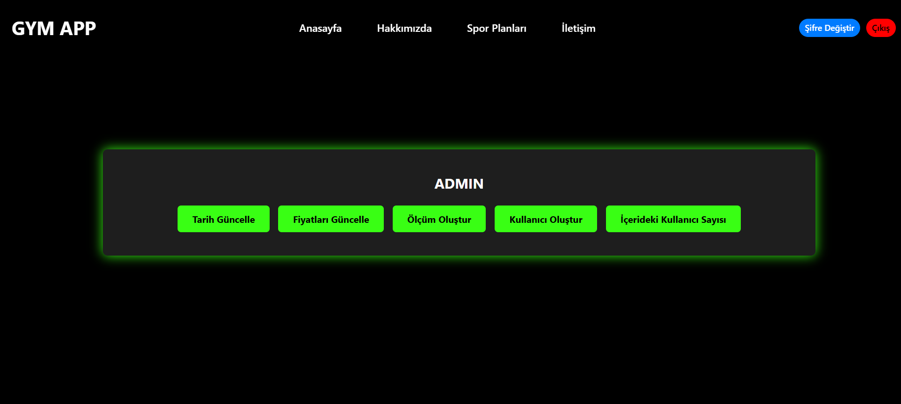
</div>

<br>

<details>
<summary>🚹 Admin - User Registration Page </summary>
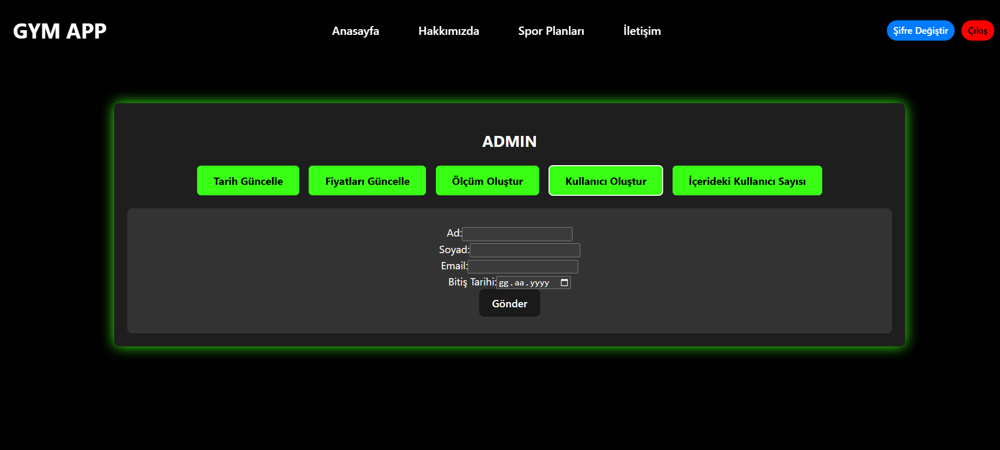
</details>

<details>
<summary>📏 Admin - Measurement Creation Page </summary>
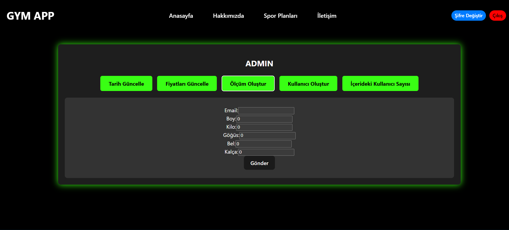
</details>

<details>
<summary>➕ Admin - View Gym Occupancy </summary>
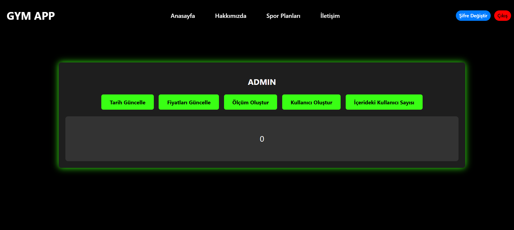
</details>

<details>
<summary>💵 Admin - Pricing Update Page </summary>
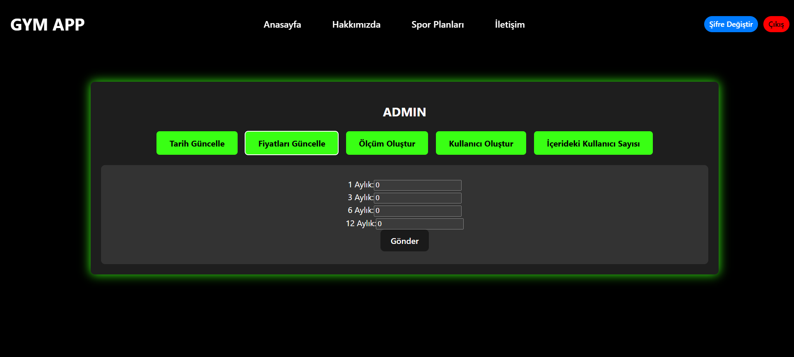
</details>

<details>
<summary>🔓 Admin - Membership Renewal Page </summary>
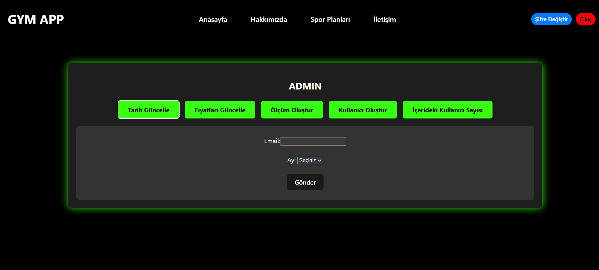
</details>

<details>
<summary>🔓 Admin - Reset Password Page </summary>
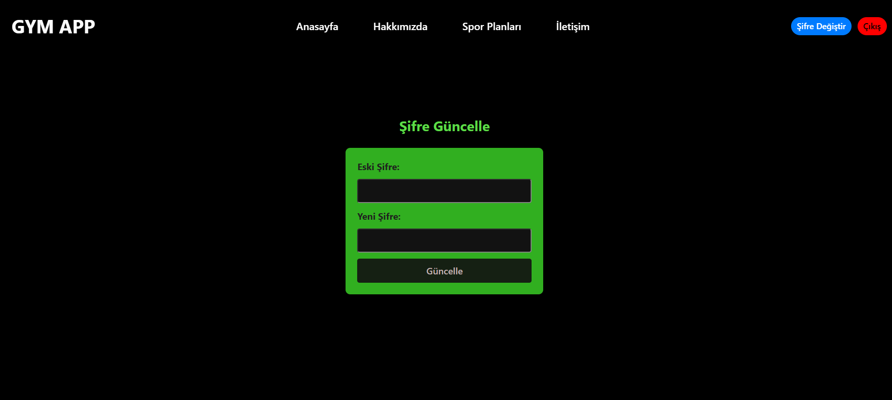
</details>
</div>

<hr>

<div>
<div align="center">
<h3>⚡User Page </h3>
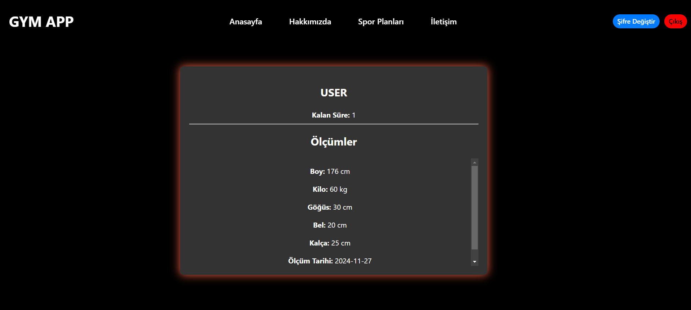
</div>

<br>

<details>
<summary>🔓 User - Reset Password Page </summary>

</details>

</div>
<hr>

<div>
<div align="center">
<h3>⚡System Architecture Overview </h3>
</div>

<details>
<summary>➕ MQTT </summary>
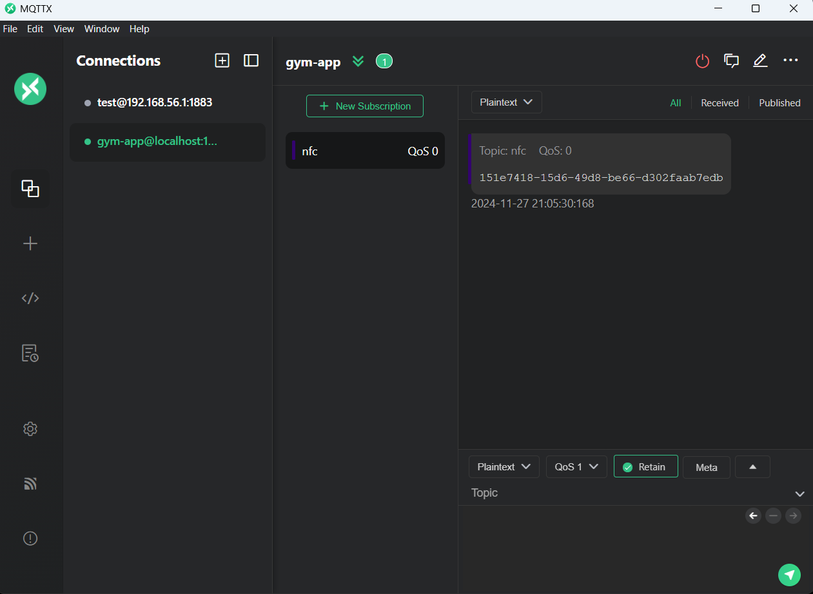
</details>

<details>
<summary>➕ Swagger UI </summary>
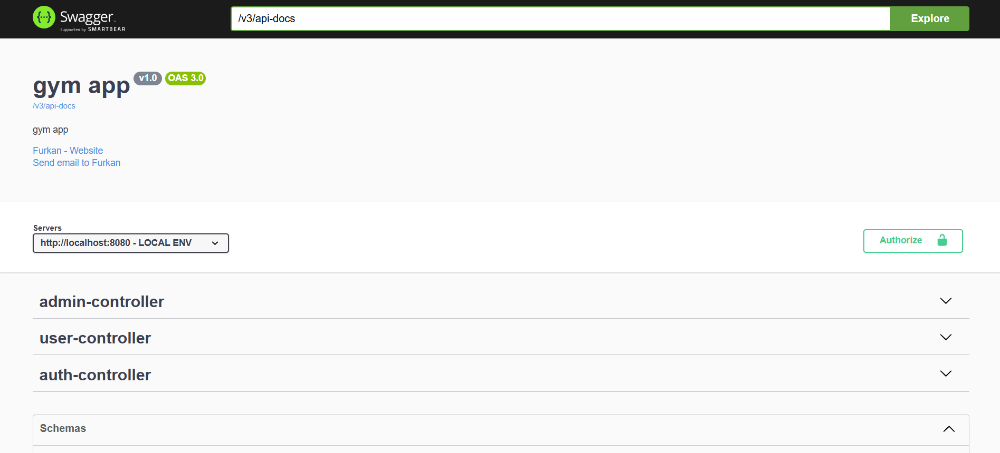
</details>

<details>
<summary>➕ Database </summary>
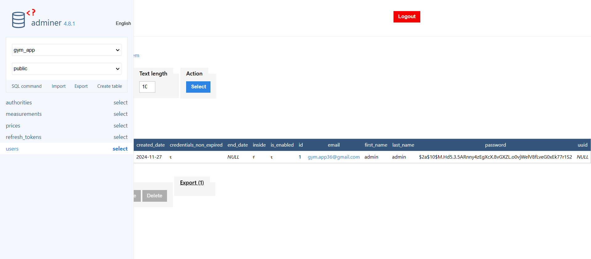
</details>

<details>
<summary>➕ Docker Compose </summary>
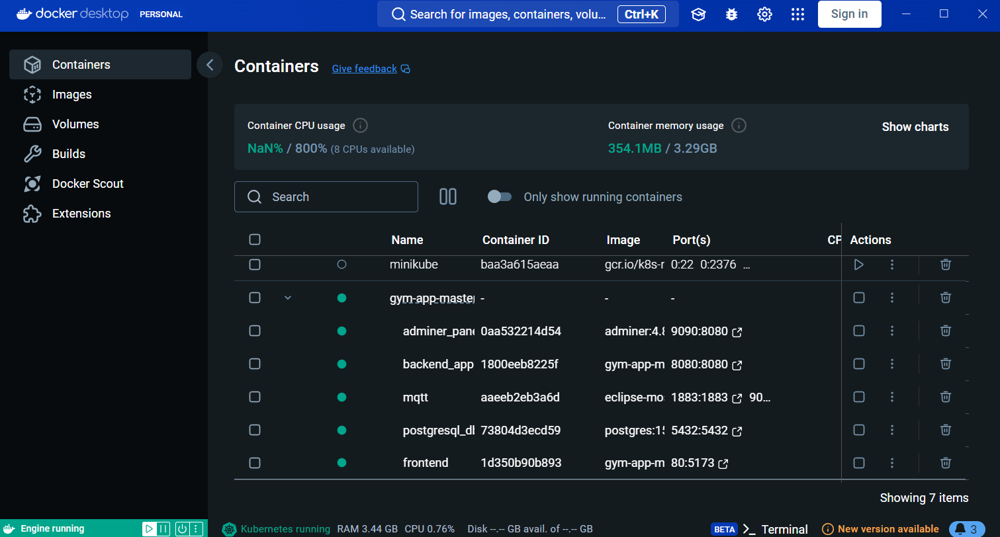
</details>

<details>
<summary>➕ Network Connection Diagram </summary>
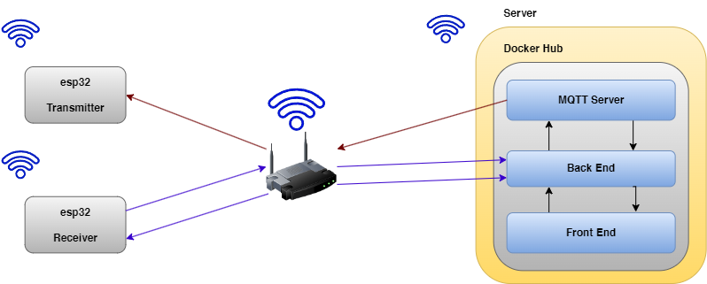
</details>

<details>
<summary>➕ Electronic Schematic </summary>
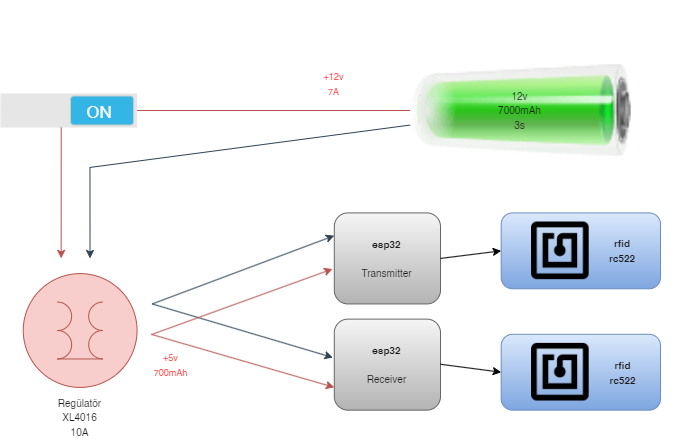
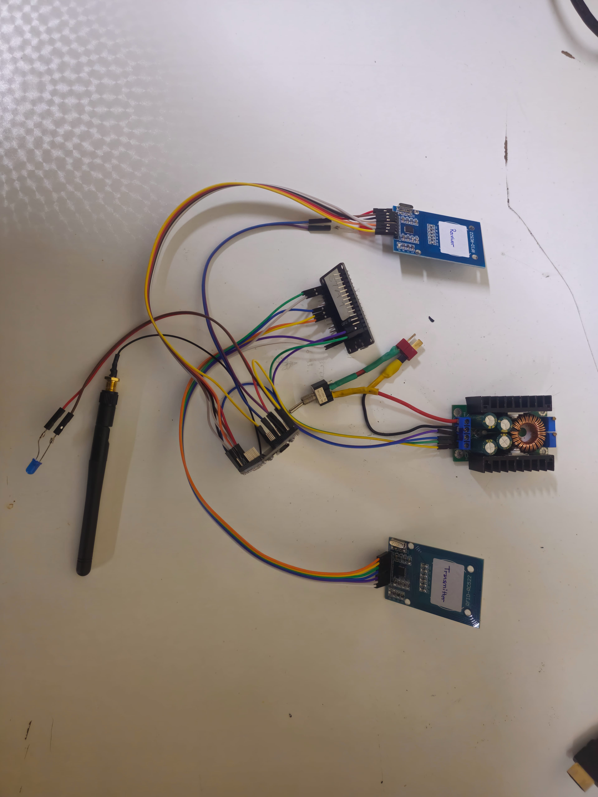
</details>

</div>
<hr>

<br>

#### Used Technologies in The Project:

[](https://react.dev/)
[](https://axios-http.com/docs/intro)
[](https://www.java.com/en/)
[](https://spring.io/)
[](https://www.postgresql.org/)
[](https://maven.apache.org/)
[](https://springdoc.org/)
[](https://docs.docker.com/)
[](./datasheet/esp32-wroom-32_datasheet_en.pdf)
[](./datasheet/XL4016-Datasheet.pdf)
[](./datasheet/MFRC522.pdf)

<br>

### Installation

```bash
git clone https://github.com/furkankayam/fullstack-gym-iot-app.git
```

<br>

### Settings

```js
//fullstack-gym-iot-app/gym-app-frontend/*

http://<SERVER_IP>:8080
```

```ino
//fullstack-gym-iot-app/esp32_gym_app_transmitter/*

const char* ssid = "<WIFI_NAME>";
const char* password = "<WIFI_PASSWORD>";
const char* mqtt_server = "<MQTT_SERVER_IP>";
```

```ino
//fullstack-gym-iot-app/esp32_gym_app_receiver/*

const char* ssid = "<WIFI_NAME>";
const char* password = "<WIFI_PASSWORD>";
const char* serverUrl = "<SERVER_ENDPOINT>";
```

<br>

### Usage

```bash
docker-compose up
```

<br>

### URL

#### ▶️ UI

```bash
http://localhost
```

#### ▶️ Swagger UI

```bash
http://localhost:8080/swagger-ui.html
```

#### ▶️ Database

```bash
http://localhost:9090
```

- `rdbms`: PostgreSQL
- `username`: postgres
- `password`: postgres
- `database`: gym_app

<br>

# License

This project is licensed under the MIT License. See the [LICENSE](LICENSE) file for details

Created by [Mehmet Furkan KAYA](https://www.linkedin.com/in/mehmet-furkan-kaya/)
